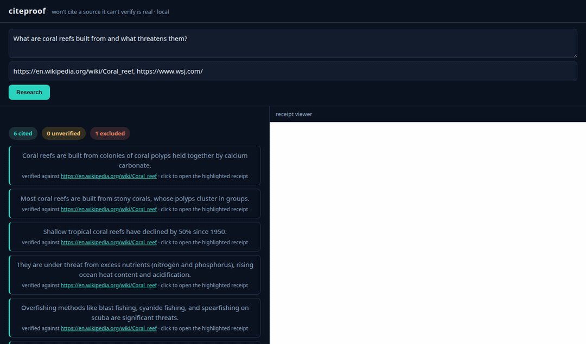

# citeproof

[](https://github.com/san64777/citeproof/actions/workflows/ci.yml)
[](LICENSE)
[](https://www.python.org/)

**Deep Research that won't cite a source it can't verify is real.** A self-hosted, local research
agent where every claim links to a "receipt": a snapshot of the exact page it fetched, highlighted to
the line that supports the claim. The differentiator is not "smarter," it is provable.

Ask a question, and citeproof fetches sources, throws out the ones it can't verify, and writes an
answer where **every cited sentence opens a snapshot with the supporting line highlighted** - or it
says it couldn't verify the claim. It runs entirely on your machine.



*Left: the answer with a verification ledger (cited / unverified / excluded-with-verdict). Right: click
any cited claim and the exact supporting line is highlighted in the snapshot. The paywalled source is
excluded, not cited.*

> **Status: working v0.** The verification core is built and validated end to end (M0 binder gate
> passed; M1 fetch/verify/snapshot spine and M2 local web app complete). It runs today via
> `python -m citeproof.app`. It is **not yet packaged** for one-command install, and the published
> launch (a one-binary build) is still ahead. See [Status](#status) and [RESULTS.md](RESULTS.md).

## The idea

Writing fluent, plausible research paragraphs is easy. The hard part, and the part that actually
matters, is whether each sentence is backed by a real source that genuinely says it. Most tools paper
over this: they cite a URL the model "remembers," or a page that was a login wall, or a line that is
close to the claim but not the same. citeproof refuses to do that.

Two gates stand between a claim and a citation:

1. **The page must be verified real.** citeproof reuses
   [veriscrape](https://github.com/san64777/veriscrape) as a verdict gate: only a page veriscrape
   verdicts `OK` (genuine, server-rendered origin content) may become a citable source. `BLOCKED`,
   `LOGIN_WALL`, `SOFT_404`, `HONEYPOT`, `EMPTY_SHELL`, and even `UNVERIFIED` are excluded and honestly
   marked "couldn't verify," never cited.
2. **The claim must be entailed by the page's text.** A local entailment model (the "binder") checks
   that a verified-OK span actually supports the claim, backed by an orthogonal symbolic check
   (numbers, dates, quantifiers, negation, direction) and anchored to a verbatim span you can click.
   If nothing supports the claim, citeproof abstains rather than guess.

The result is fewer cited claims, but every one is traceable to a verified-real source and a
highlighted line. That is the whole product: provable, not persuasive.

## What you get

- A **split-screen web app**: ask a question, get an answer with a **verification ledger**
  (N cited / M unverified / K excluded-with-verdict).
- Every **cited** claim is a link that opens the **snapshot of the source with the supporting line
  highlighted** - click-to-verify.
- Claims the binder couldn't ground are shown **unverified**, not hidden.
- Sources it couldn't verify are listed **with their verdict** (paywall, login wall, JS shell, ...),
  excluded honestly instead of cited.
- Search the **whole web** (keyless DuckDuckGo + Wikipedia, or a self-hosted SearXNG), or paste your
  own URLs.

## Quickstart

citeproof runs locally and uses local models. A CUDA GPU is recommended (it was built and validated
on an RTX 3060, 12 GB); it will run CPU-only but slowly.

**1. Prerequisites**

- Python 3.12+ and [uv](https://docs.astral.sh/uv/)
- [Ollama](https://ollama.com/) for the local writer model: `ollama pull qwen3:8b`
- Node.js (optional) for high-fidelity snapshots via the SingleFile CLI

**2. Install**

```bash
git clone https://github.com/san64777/citeproof
cd citeproof
uv sync --extra binder --extra app          # binder = the entailment models; app = the web UI
# MiniCheck (the primary entailment model) is not on PyPI - install it from source:
uv pip install "minicheck @ git+https://github.com/Liyan06/MiniCheck.git@main"
uv run python -c "import nltk; nltk.download('punkt_tab')"
```

> Note: `uv sync` rebuilds the environment from the lockfile and will **remove** MiniCheck (a git
> dependency that cannot be locked). Re-run the `uv pip install "minicheck @ ..."` line after any
> `uv sync`.

First run downloads the model weights once (MiniCheck-RoBERTa-Large ~1.4 GB, a DeBERTa-v3 NLI
~0.7 GB, plus the qwen3:8b GGUF ~5 GB via Ollama).

**3. Run**

```bash
uv run python -m citeproof.app        # serves http://127.0.0.1:8417
```

Open http://127.0.0.1:8417, ask a question (optionally paste source URLs), and click any cited claim
to open its highlighted receipt. A query takes roughly 30 seconds on a GPU (local model + verifier).

Optional environment variables:

| variable | effect |
|---|---|
| `CITEPROOF_HOST` | bind address (default `127.0.0.1`; set `0.0.0.0` to reach it across a WSL2/LAN boundary) |
| `SEARXNG_URL` | use a self-hosted [SearXNG](https://github.com/searxng/searxng) instance for fully-local whole-web search |
| `CITEPROOF_SEARCH=wikipedia` | encyclopedic-only search (most reliable, zero web noise) |
| `OLLAMA_MAX_LOADED_MODELS=1` | keep the GPU from thrashing (recommended) |

## How it works

1. **Fetch.** curl_cffi over HTTP first; a headless Chromium render only to recover a JavaScript-only
   page (an `EMPTY_SHELL` verdict), nothing more.
2. **Verify.** Every fetched page goes through the veriscrape verdict gate. Only strict
   `verdict == OK` survives; everything else is excluded with its verdict shown.
3. **Snapshot + read.** The verified bytes are saved as one sha256-pinned artifact, and the main text
   is extracted from *that* artifact (re-hashed before every read), so the text verified, the line
   highlighted, and the page you open are guaranteed identical.
4. **Draft.** A local model (Ollama, default qwen3:8b, swappable) writes short, source-grounded
   sentences from the verified pages only.
5. **Bind.** Each sentence is checked against candidate spans with a fine-tuned entailment model
   (MiniCheck-RoBERTa-Large), a different-lineage second-signal NLI (DeBERTa-v3), and an orthogonal
   symbolic check, then attached to a verbatim span or left unverified. Abstain over guess.
6. **Receipt.** Each cited claim re-anchors its span in the snapshot and highlights it in the browser
   via the CSS Custom Highlight API. If the span can't be re-located, it is dropped, never
   mis-highlighted.

Everything runs locally: a local LLM via Ollama, a local entailment stack, and local search. No cloud
model, no telemetry. Apache-2.0, self-hosted, offline-capable once the models are cached.

## Results

On an AI-labeled evaluation set, run through the real veriscrape gate and the full production binder,
with thresholds frozen on a dev fold before scoring a held-out test fold: **citation precision 0.98**
(lower bound), **0.96 on the hardest near-miss cases**, at **recall 0.57**, with **false-OK 0.23%**
(one junk page wrongly admitted out of 433). End to end on a 10-question benchmark: every cited claim
produced a working highlighted receipt, every blocked/paywalled page was excluded with its verdict,
and unanswerable questions cited nothing. Full methodology, caveats, and the honest limits are in
[RESULTS.md](RESULTS.md).

## What it is NOT

- **Not about defeating blocks.** When a source is behind a hard wall, veriscrape says so and
  citeproof excludes it. That honesty is the point, not a limitation to work around.
- **Not "smarter than Perplexity."** A local model writes correct-but-shallow prose. citeproof
  competes on whether you can verify what it wrote, not on eloquence.
- **Not a literal guarantee of truth.** Local entailment is not perfect. The honest, testable claim is
  narrower: every cited claim passed a local entailment gate against a verified-OK source and is
  anchored to a verbatim span, with the precision and abstention numbers published in
  [RESULTS.md](RESULTS.md).

## Built on

- [veriscrape](https://github.com/san64777/veriscrape) - the verified-fetch primitive that supplies
  the `OK` verdict gate.
- [MiniCheck](https://github.com/Liyan06/MiniCheck) (MIT) - the fact-checking entailment model.
- [Ollama](https://ollama.com/), [trafilatura](https://github.com/adbar/trafilatura),
  [ddgs](https://github.com/deedy5/ddgs).

## Contributing

The most useful contributions are adversarial: hard claim/source pairs that should (or should not)
cite, red-teaming the gate's honesty, and counterexamples of a wrong-highlight receipt. See
[CONTRIBUTING.md](CONTRIBUTING.md) and the [security policy](SECURITY.md).

## License

Apache-2.0. The runtime dependency tree is zero viral copyleft (no GPL / AGPL / LGPL / SSPL), enforced
in CI from the first commit. SingleFile (AGPL) and an optional SearXNG instance are used only as
separate processes, never imported. Clean-room: no employer code.

---

*Built by Sanjay Chauhan, who builds reliability and data-integrity primitives for data pipelines.
Reach me at san64777@gmail.com.*
